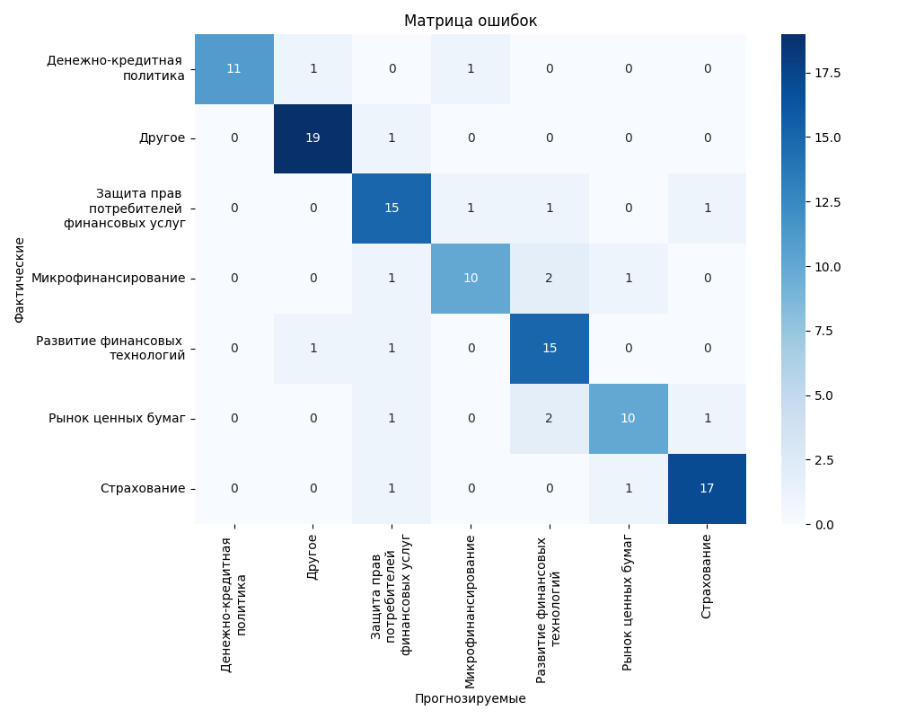
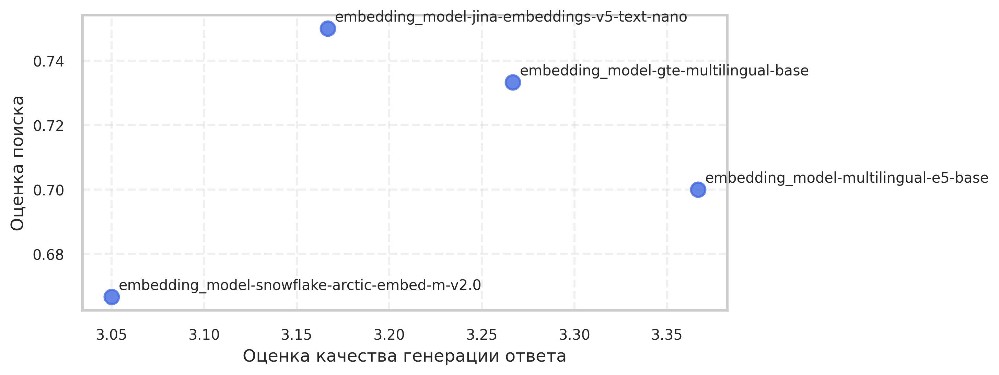
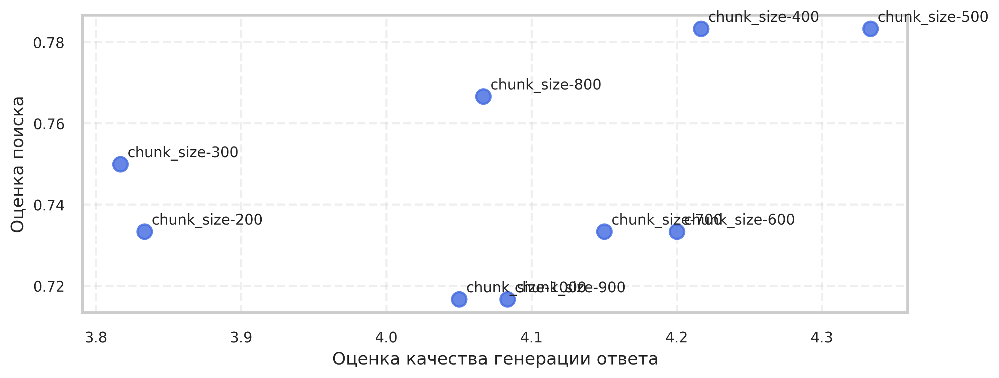
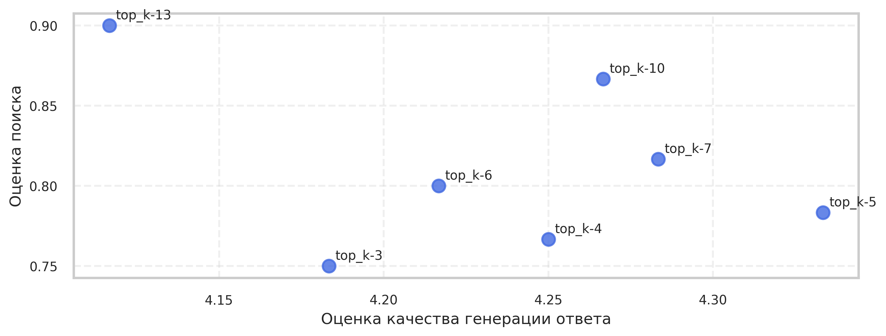
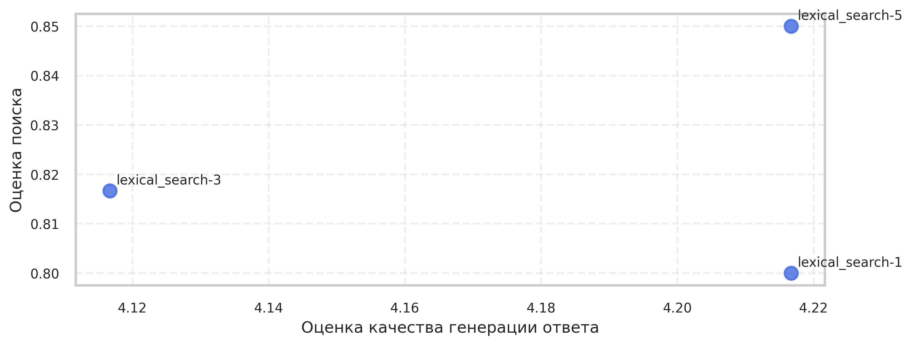
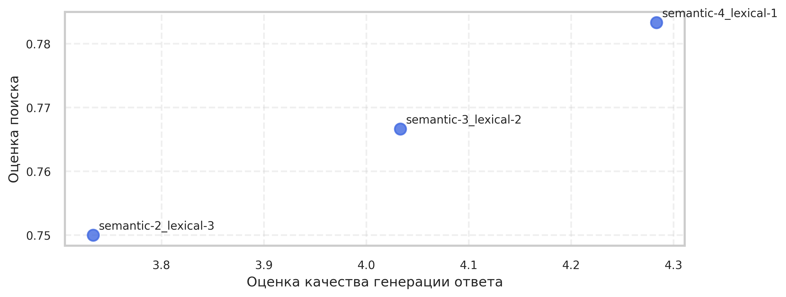
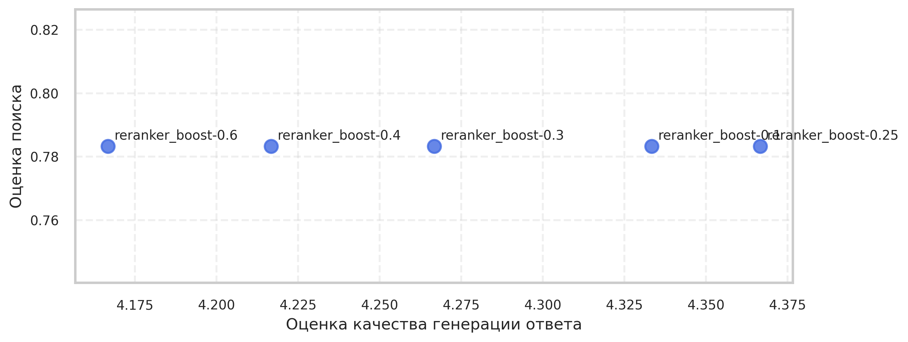

# RAG-система с локальной LLM

Retrieval Augmented Generation система для поиска информации по документам финансового сектора с использованием локальной LLM.

Проект построен на:

- FastAPI
- PostgreSQL + pgvector
- llama.cpp
- Docker

Система принимает пользовательский вопрос, находит релевантные фрагменты документов и генерирует ответ на основе найденного контекста.

---

# Возможности

- Ingestion pipeline для документов
- Семантический поиск через косинусное сходство векторов с использованием hnsw индекса
- Лексический поиск с помощью PostgreSQL Full Text Search
- Поддержка гибридного поиска
- Ранжирование результатов поиска на основе модели логистической регрессии, предсказывающей категорию документа по вопросу
- Модуль оценки качества генерации и поиска системы (результаты экспериментов сохраняются в json)
- FastAPI API
- Локальная LLM через llama.cpp
- Генерация синтетического датасета для оценки
- Полностью контейнеризированная инфраструктура

---

# Архитектура


# Модель данных


# Ingestion Pipeline

Документы проходят несколько этапов обработки:


Пайплайн поддерживает расширяемые экстракторы и различные чанкинг стратегии.


---

# Поиск

Система поддерживает несколько типов поиска.

## Семантический поиск

Используется:
- pgvector
- косинусное сходство векторов
- HNSW


## Лексический поиск

- PostgreSQL Full Text Search


## Гибридный поиск

Результаты нескольких ретриверов:
- объединяются
- нормализуются
- дедуплицируются
- передаются в реранкер

---


# Оценка системы

Оценка разработанной системы включает два ключевых аспекта: точность извлечения релевантных фрагментов и качество сгенерированных ответов на основе этих фрагментов.

<table>
  <tr>
    <td align="center">
      <br/>
      <b>Оценка поиска</b>
    </td>
    <td align="center">
      <br/>
      <b>Оценка генерации</b>
    </td>
  </tr>
</table>


---
# Генерация синтетического датасета

Проект поддерживает генерацию синтетического датастеа для оценки качества системы.

Документы для оценки инжестятся в отдельный источник.


---
# Ранжирование чанков

Была обучена модель логистической регрессии, предсказывающая степень релевантности различных категорий документов к заданному пользовательскому запросу. 

Полученные предсказания используются для перестановки чанков, в результате чего наиболее релевантные чанки перемещаются в начало итогового списка.


## Метрики классификации
| Категория                                 | Precision | Recall | F1-score |
| ----------------------------------------- | --------: | -----: | -------: |
| Денежно-кредитная политика                |      1.00 |   0.85 |     0.92 |
| Другое                                    |      0.90 |   0.95 |     0.93 |
| Защита прав потребителей финансовых услуг |      0.75 |   0.83 |     0.79 |
| Микрофинансирование                       |      0.83 |   0.71 |     0.77 |
| Развитие финансовых технологий            |      0.75 |   0.88 |     0.81 |
| Рынок ценных бумаг                        |      0.83 |   0.71 |     0.77 |
| Страхование                               |      0.89 |   0.89 |     0.89 |

 
---
# Технологический стек

## Backend

- Python 3.11
- FastAPI
- Async SQLAlchemy


## База данных

- PostgreSQL
- pgvector


## LLM

- llama.cpp server
- локальные GGUF модели


## Инфраструктура

- Docker
- Docker Compose

---

# Тестирование системы
База данных наполнена 1328 документами и содержит 11529 чанков.

Для генерации ответа используется квантованная LLM Qwen3-14B-Q4_K_M

В качестве модели оценщика используется квантованная модель saiga-8b-v7-q4_k_m

## 1. Тестирование моделей векторизации текста



## 2. Эксперименты по настройке размера чанков и количества возвращаемых чанков





## 3. Тестирование количества фрагментов, возвращаемых лексическим поиском



## 4. Тестирование гибридного поиска




## 5. Тестирование ранжироавния



---

# API

## POST /query

### Request

```json
{
  "question": "Какие основные типы мошеннечества распространены в финансовом секторе?",
  "top_k": 5
}
```


### Response

```json
{
  "answer": "...",
  "sources": "..."
}
```

---

# Планируемые улучшения

- Улучшение качества модели классификации на основе логистической регресии
- Улучшение стратегии ранжирования
- Расширение обучающего датасета для повышения качества предсказаний категорий
- Добавление cross-encoder реранкера 
- Учет позиции чанка внутри документа
- Предобработка пользовательского запроса
- Добавление в тестовый датасет разные типы вопросов: фактический, кросс-чанковый, перефразируемый и вопрос на который нет ответа в бд


